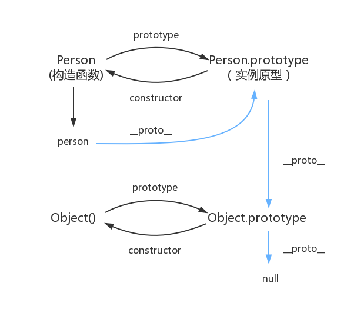

# js知识点梳理,实际开发或者面试中遇到的 js 问题,
### String

* str.concat()
        
        let a = '123'
        let b = '456'
        let c = a.concat(b)
        console.log(c) //123456
        
* str.indexOf()

        let i = 'qwerasd'.indexOf('a')
        let n = 'qwerasd'.indexOf('z')
        console.log(i) // 4
        console.log(n) // -1
        
* str.charAt()

        字符串中第一个字符的下标是 0。
        如果参数 index 不在 0 与 string.length 之间，该方法将返回一个空字符串。
        let a = 'qwerasd'
        console.log(a.charAt(1)) // 'w'
        console.log(a.charAt(100)) // ''
        
* str.lastIndexOf()

        返回字符串中一个子串最后一处出现的索引（从右到左搜索），如果没有匹配项，返回 -1
        let a = 'qwerasd'
        console.log(a.lastIndexOf(1))//-1
        console.log(a.lastIndexOf('a'))//4
        
* str.substring()

        str.substring(start,end)//end不传默认到结尾 不能传负数
        
* str.substr()

        str.substr(start,length) //length不传默认到结尾 
        ECMAscript 没有对该方法进行标准化，因此反对使用它。
        
* str.replace()

        str.replace(regexp/substr,replacement)//替换
        
* search 

        stringObject.search(regexp)
        stringObject 中第一个与 regexp 相匹配的子串的起始位置。
        注释：如果没有找到任何匹配的子串，则返回 -1。
        
* match

        如果 regexp 没有标志 g，那么 match() 方法就只能在 stringObject 中执行一次匹配。
        如果没有找到任何匹配的文本， match() 将返回 null。否则，它将返回一个数组，
        其中存放了与它找到的匹配文本有关的信息。该数组的第 0 个元素存放的是匹配文本，
        而其余的元素存放的是与正则表达式的子表达式匹配的文本。除了这些常规的数组元素之外，
        返回的数组还含有两个对象属性。index 属性声明的是匹配文本的起始字符在 
        stringObject 中的位置，input 属性声明的是对 stringObject 的引用。
        
        如果 regexp 具有标志 g，则 match() 方法将执行全局检索，找到 stringObject 
        中的所有匹配子字符串。若没有找到任何匹配的子串，则返回 null。如果找到了一个或多个匹配子串，
        则返回一个数组。不过全局匹配返回的数组的内容与前者大不相同，它的数组元素中存放的是 
        stringObject 中所有的匹配子串，而且也没有 index 属性或 input 属性。
        
        let a = 'qwerasdqw'
        console.log(a.match(/\qw+/))
        //[ 'qw', index: 0, input: 'qwerasdqw', groups: undefined ]
        console.log(a.match(/\qw+/g))
        //[ 'qw', 'qw' ]

* slice
        
        字符串截取
        let a = 'qwerasd'
        console.log(a.slice(0, 1))//'q'
        console.log(a.slice(-1))//'d'
        console.log(a.slice(-4, -2))//'ra'
        
        
* split

        字符串分割成字符串数组
        stringObject.split(separator,howmany)
        separator:字符串或正则表达式，从该参数指定的地方分割 stringObject。
        howmany:可选。该参数可指定返回的数组的最大长度。
                如果设置了该参数，返回的子串不会多于这个参数指定的数组。
                如果没有设置该参数，整个字符串都会被分割，不考虑它的长度。
        console.log(a.split(' ',1))//['qwerasd']
        console.log(a.split('',2))//['q', 'w']
        console.log(a.split('',3))//['q', 'w', 'e']

### Array

* 判断是否是数组
    
        Object.prototype.toString.call(array) === ‘[object Array]’;
* push()和concat()

        push()是在原数组的基础上修改的，执行push()方法后原数组的值也会变,并返回新的长度；
        concat()是先把原数组复制到一个新的数组，然后在新数组上进行操作，所以不会改变原数组的值。
        如果参数不是数组，
            不管参数个数有多少个，push()和concat()都会直接把参数添加到数组后；
        如果参数是一个数组，  
            push()就会直接把数组添加到原数组后，
            而concat()会把数组里的值取出来添加到原数组后。
* pop()

        将删除 arrayObject 的最后一个元素，把数组长度减 1，并且返回它删除的元素的值。
        如果数组已经为空，则 pop() 不改变数组，并返回 undefined 值。
* shift()
        
        把数组的第一个元素从其中删除，并返回第一个元素的值。
        如果数组是空的，那么 shift() 方法将不进行任何操作，返回 undefined 值
* unshift(1)
        
        向数组的开头添加一个或更多元素，并返回新的长度。
        如果数组是空的，那么 shift() 方法将不进行任何操作，返回 undefined 值
* join(separator)
        
        把数组中的所有元素放入一个字符串。
        separator 指定要使用的分隔符。如果省略该参数，则使用逗号作为分隔符
* toString()
        
        把数组转换为字符串，并返回结果。返回值与没有参数的 join() 方法返回的字符串相同。
* slice()
        
        切割数组,返回新数组
* arr.flat(Infinity)
        
        多维数组扁平化
* splice(index,howMany,item1,.....,itemX)
        
        从数组中添加/删除项目，然后返回被删除的项目。
        item1,.....,itemX可选,是向数组中添加的元素
* sort()
        
        按照ASCII码进行排序
        const compare = function (x, y) {//比较函数
        	if (x < y) {
        		return -1;
        	} else if (x > y) {
        		return 1;
        	} else {
        		return 0;
        	}
        }
        arr.sort(compare)

### Object

* Object.keys(arr)
        
        遍历可枚举的属性，只包含对象本身可枚举属性，不包含原型链可枚举属性
        let arr = ["a", "b", "c"];
        let obj = { foo: "bar", baz: 42 };
        let ArrayLike = { 0 : "a", 1 : "b", 2 : "c"};
        
        Object.keys(arr)        // ['0', '1', '2']
        Object.keys(obj)        // ["foo","baz"]
        Object.keys(ArrayLike)  // ['0', '1', '2']
* Object.values(arr)
        
        遍历可枚举的属性值，只包含对象本身可枚举属性值，不包含原型链可枚举属性
        let arr = ["a", "b", "c"];
        let obj = { foo: "bar", baz: 42 };
        let ArrayLike = { 0 : "a", 1 : "b", 2 : "c"};
        
        Object.values(arr)      // ["a", "b", "c"]
        Object.values(obj)          // ["bar",42]
        Object.values(ArrayLike)    // ["a", "b", "c"]
* Object.is(a,b)

        两个值都是 undefined
        两个值都是 null
        两个值都是 true 或者都是 false
        两个值是由相同个数的字符按照相同的顺序组成的字符串
        两个值指向同一个对象
        两个值都是数字并且
        都是正零 +0
        都是负零 -0
        都是 NaN
        都是除零和 NaN 外的其它同一个数字
        
        if (!Object.is) {
          Object.is = function(x, y) {
            if (x === y) { // Steps 1-5, 7-10
              // 针对 +0不等于-0
              return x !== 0 || 1 / x === 1 / y;
            } else {
              // 针对 NaN等于NaN
              return x !== x && y !== y;
            }
          };
        }

### 问题

* 防抖和节流
        
        防抖:动作绑定事件，动作发生后一定时间后触发事件，
            在这段时间内，如果该动作又发生，则重新等待一定时间再触发事件。
        function debounce(func, time) {
            let timer = null;
            return () => {
              clearTimeout(timer);
              timer = setTimeout(()=> {
                func.apply(this, arguments)
              }, time);
            }
        }
        节流:动作绑定事件，动作发生后一段时间后触发事件，
            在这段时间内，如果动作又发生，则无视该动作，直到事件执行完后，才能重新触发。
        function throtte(func, time) {
            let activeTime = 0
            return () => {
                const current = Date.now()
                if(current - activeTime > time){
                    func.apply(this, time)
                    activeTime = Date.now()
                }
            }
        }
* Promise 构造函数是同步执行还是异步执行，那么 then 方法呢

        const promise = new Promise((resolve, reject) => {
          console.log(1)
          resolve()
          console.log(2)
        })
        
        promise.then(() => {
          console.log(3)
        })
        
        console.log(4)
        执行结果是：1243
        promise构造函数是同步执行的，then方法是异步执行的
* 如何实现一个 new
        
        function _new(fn, ...arg) {
            const obj = Object.create(fn.prototype);
            const ret = fn.apply(obj, arg);
            return ret instanceof Object ? ret : obj;
        }
        
* TCP 三次握手和四次挥手

    
    
        男：我要挂了哦
        女：等哈，我还要敷面膜
        女：我敷完了，现在可以挂了
        男：我舍不得挂，你挂吧
        女：好吧，我挂了
        男：等了2MSL听见嘟嘟嘟的声音后挂断

* react中的setState
    
        setTimeout/setInterval中 同步更新setState
        react提供的函数中,setState会合并比如 componentDidMount,onClick
        
* npm 模块安装机制：

      发出npm install命令
      查询node_modules目录之中是否已经存在指定模块
        若存在，不再重新安装
        若不存在
          npm 向 registry 查询模块压缩包的网址
          下载压缩包，存放在根目录下的.npm目录里
          解压压缩包到当前项目的node_modules目录

* 观察者模式和订阅-发布模式
    
        观察者模式没中间商赚差价     --被动技能
        发布订阅模式 有中间商赚差价  --主动技能

* cookie 和 token 都存放在 header 中，为什么不会劫持 token

    >cookie：登陆后后端生成一个sessionid放在cookie中返回给客户端，并且服务端一直记录着这个sessionid，客户端以后每次请求都会带上这个sessionid，服务端通过这个sessionid来验证身份之类的操作。所以别人拿到了cookie拿到了sessionid后，就可以完全替代你。
     
     >token：登陆后后端不返回一个token给客户端，客户端将这个token存储起来，然后每次客户端请求都需要开发者手动将token放在header中带过去，服务端每次只需要对这个token进行验证就能使用token中的信息来进行下一步操作了。
     
    > xss：用户通过各种方式将恶意代码注入到其他用户的页面中。就可以通过脚本获取信息，发起请求，之类的操作。
     
    > csrf：跨站请求攻击，简单地说，是攻击者通过一些技术手段欺骗用户的浏览器去访问一个自己曾经认证过的网站并运行一些操作（如发邮件，发消息，甚至财产操作如转账和购买商品）。由于浏览器曾经认证过，所以被访问的网站会认为是真正的用户操作而去运行。这利用了web中用户身份验证的一个漏洞：简单的身份验证只能保证请求发自某个用户的浏览器，却不能保证请求本身是用户自愿发出的。csrf并不能够拿到用户的任何信息，它只是欺骗用户浏览器，让其以用户的名义进行操作。
     
    > csrf例子：假如一家银行用以运行转账操作的URL地址如下： http://www.examplebank.com/withdraw?account=AccoutName&amount=1000&for=PayeeName
     那么，一个恶意攻击者可以在另一个网站上放置如下代码： ">
     如果有账户名为Alice的用户访问了恶意站点，而她之前刚访问过银行不久，登录信息尚未过期，那么她就会损失1000资金。

        上面的两种攻击方式，如果被xss攻击了，不管是token还是cookie，都能被拿到，所以对于xss攻击来说，cookie和token没有什么区别。但是对于csrf来说就有区别了。
        
        以上面的csrf攻击为例：
        
        cookie：用户点击了链接，cookie未失效，导致发起请求后后端以为是用户正常操作，于是进行扣款操作。
        token：用户点击链接，由于浏览器不会自动带上token，所以即使发了请求，后端的token验证不会通过，所以不会进行扣款操作。

* 手写一个数据绑定：

        <input id="input" type="text" />
        

        
        let input = document.getElementById("input");
        let text = document.getElementById("text");
        let data = { value: "" };
        Object.defineProperty(data, "value", {
          set: function(val) {
            text.innerHTML = val;
            input.value = val;
          },
          get: function() {
            return input.value;
          }
        });
        input.onkeyup = function(e) {
          data.value = e.target.value;
        };

* this用法
        
        this 永远指向最后调用它的那个对象，this 永远指向最后调用它的那个对象，this 永远指向最后调用它的那个对象。
        1、 由箭头函数调用 ->指向箭头函数外层非箭头函数的this指向 ;
        2、 由new调用 ->指向新创建的对象 ;
        3、 由call || apply || bind 调用 -> 指向指定的对象 ;
        4、 由对象调用 -> 指向这个对象 ;
        5、 上面几种情况都不是：严格模式下指向undefined，非严格模式下指向全局对象
        
* 作用域和作用域链

        作用域就是代码的执行环境,
        作用域链:内部环境可以通过作用域链访问所有外部环境，但外部环境不能访问内部环境的任何变量和函数。

        变量:声明和赋值
            var:会变量提升
            let,const:不会变量提升
        无论在全局作用域或者函数作用域中，只要通过 var 关键字声明的变量，不论在哪里声明，都会被当成在当前作用域顶部声明的变量
        其实，变量提升的机制，不太符合我们的编码习惯，我们常常希望代码能够按照顺序执行，这也符合一般人的逻辑习惯。
        为此 ES6 引入了块级作用域的概念。
        块级作用域其实就是词法作用域，我们的代码写在哪，就会在哪里执行，这更符合我们的编程习惯。
        我们常说的块包括函数内部 和 {}之间的部分。
        为了实现块级作用域，ES6 采用 let 和 const 代替 var 来声明变量。
        用 let 和 const 声明的变量会把变量的作用域限制在当前的代码块中，
        并且声明的变量不会被提升。另外，用 let 声明的变量，在同一代码块内，禁止重复声明
        
        

* 闭包
        
        函数外部不能访问函数内部变量,闭包可以在函数外部访问函数内部的变量
        function fun(){
            let n = 999;
            function show(){
                return n
            }
            return show
        }
        let a = fun()
        console.log(a.show())

* 构造函数
        
        用new来调用的函数,叫做构造函数
        在使用对象创建多个统一类型的对象时,这些对象会有相似的属性和方法,构造函数可以实现代码复用
        function Person(name, gender, hobby) {
          this.name = name;
          this.gender = gender;
          this.hobby = hobby;
          this.age = 6;
        }
        
        var p1 = new Person('zs', '男', 'basketball'); //this指向p1
        
        没有手动添加返回值，默认返回 this 。
        手动添加一个基本数据类型的返回值，最终还是返回 this。
        手动添加一个复杂数据类型(对象)的返回值，最终返回该对象

* 原型和原型链
        
        function Person(name, age) {
            this.name = name;
            this.age = age;
            this.say = function() {
                console.log('Hello');
            };
        }
        
        var p1 = new Person('Tom', 18);
        p1.say();  // 'Hello'
        var p2 = new Person('Jack', 34);
        p2.say();  // 'Hello'
        
        console.log(p1.say == p2.say); // false
        每次通过构造函数的形式来调用时,都会开辟一个新的内存空间,所以,p1和p2的内存地址是不一样的.
        但是,Person中,say方法的功能是同一个.如果要调用多次,就会浪费
        
        改进:
            function Person(name, age) {
                this.name = name;
                this.age = age;
            }
            Person.prototype.say = function() {
                 console.log('Hello');
            };
            var p1 = new Person('Tom', 18);
            var p2 = new Person('Jack', 34);
            console.log(p1.say === p2.say); // true
            
            Person.prototype === p1.__proto__;   // true
            Person.prototype === p2.__proto__;   // true
            p1.__proto__ === p2.__proto___;      // true
        
        *当一个函数 (注意：不仅仅只有构造函数) 创建好之后，都会有一个 prototype 属性，
        这个属性的值是一个对象，我们把这个对象，称为原型对象。
        同时，只要在这个原型对象上添加属性和方法，这些属性和方法都可以被该函数的实例所访问。
        
        原型对象上，有一个 constructor 属性指向该函数本身；
        function Person() {
            // ...
        }
        console.log(Person.prototype.constructor === Person); // true
        
        当某个函数A当做构造函数来调用时,会产生一个实例对象,这个实例上会有一个__proto__属性,
        这个属性指向A的原型对象(prototype)
        
        如下图,就是原型的理解,其中蓝色的就是原型链
        
 

* bind call apply
    
      apply() 方法调用一个函数, 其具有一个指定的this值，以及作为一个数组（或类似数组的对象）提供的参数.
      apply 和 call 基本类似，他们的区别只是传入的参数不同.
      bind 是创建一个新的函数，我们必须要手动去调用.
      var obj = {
        age: 22
      }
    
      function say(name) {
        console.log('我是：' + name + '|今年：' + this.age);
      }
    
      say.call(obj, 'jack'); // 我是：jack|今年：22
      say.apply(obj, ['mike']); // 我是：mike|今年：22
    
* 继承
        
        继承的根本思想就是原型链
### es5继承:

#### 组合继承,将原型链和构造函数组合到一起来实现继承,思路就是

        通过原型链来对    属性和方法的继承,
        通过构造函数对    实例属性的继承.
        
        function Father(name) {
        	this.name = name;
        	this.colors = ['red', 'blue', 'green'];
        }
        
        Father.prototype.sayName = function () {
        	console.log(this.name);
        };
        
        function Son(name, age) {
        	Father.call(this, name);//继承实例属性，第一次调用Father()
        	this.age = age;
        }
        
        Son.prototype = new Father();//继承父类方法,第二次调用Father()
        Son.prototype.sayAge = function () {
        	console.log(this.age);
        };
        let instance1 = new Son('louis', 5);
        instance1.colors.push('black');
        console.log(instance1.colors);//"red,blue,green,black"
        instance1.sayName();//louis
        instance1.sayAge();//5
        let instance2 = new Son('zhai', 10);
        console.log(instance2.colors);//"red,blue,green"
        instance2.sayName();//zhai
        instance2.sayAge();//10
            
#### 寄生组合继承

        // 组合继承最大的问题就是无论什么情况下,都会调用两次父类构造函数:
        // 一次是在创建子类型原型的时候, 另一次是在子类型构造函数内部.
        // 寄生组合式继承就是为了降低调用父类构造函数的开销而出现的 .
        //其背后的基本思路是: 不必为了指定子类型的原型而调用超类型的构造函数
        function inherit(son, father) {
        	//Object.create() 接收两个参数:
        		// 1 一个用作新对象原型的对象
        		// 2 (可选的)一个为新对象定义额外属性的对象
        	let prototypeObj = Object.create(father.prototype);//创建对象
        	prototypeObj.constructor = son;//增强对象
        	son.prototype = prototypeObj;//指定对象
        }

        function Father(name) {
            this.name = name;
            this.colors = ['red', 'blue', 'green'];
        }
        
        Father.prototype.sayName = function () {
            console.log(this.name);
        };
        
        function Son(name, age) {
            Father.call(this, name);//继承实例属性，第一次调用Father()
            this.age = age;
        }
        
        //Son.prototype = new Father();//继承父类方法,第二次调用Father()
        inherit(Son, Father);
        Son.prototype.sayAge = function () {
            console.log(this.age);
        };
        let instance1 = new Son('louis', 5);
        instance1.colors.push('black');
        console.log(instance1.colors);//"red,blue,green,black"
        instance1.sayName();//louis
        instance1.sayAge();//5
        let instance2 = new Son('zhai', 10);
        console.log(instance2.colors);//"red,blue,green"
        instance2.sayName();//zhai
        instance2.sayAge();//10

###es6继承
        
        extends 
        因为子类自己的this对象，必须先通过父类的构造函数完成塑造，
        得到与父类同样的实例属性和方法，然后再对其进行加工，
        加上子类自己的实例属性和方法。如果不调用super方法，子类就得不到this对象。
        
        class A {
          static hello() {
            console.log('hello world');
          }
        }
        
        class B extends A {
        }
        
        B.hello()  // hello world

* 深拷贝

        js深拷贝 ==> ./src/deepClone.js
